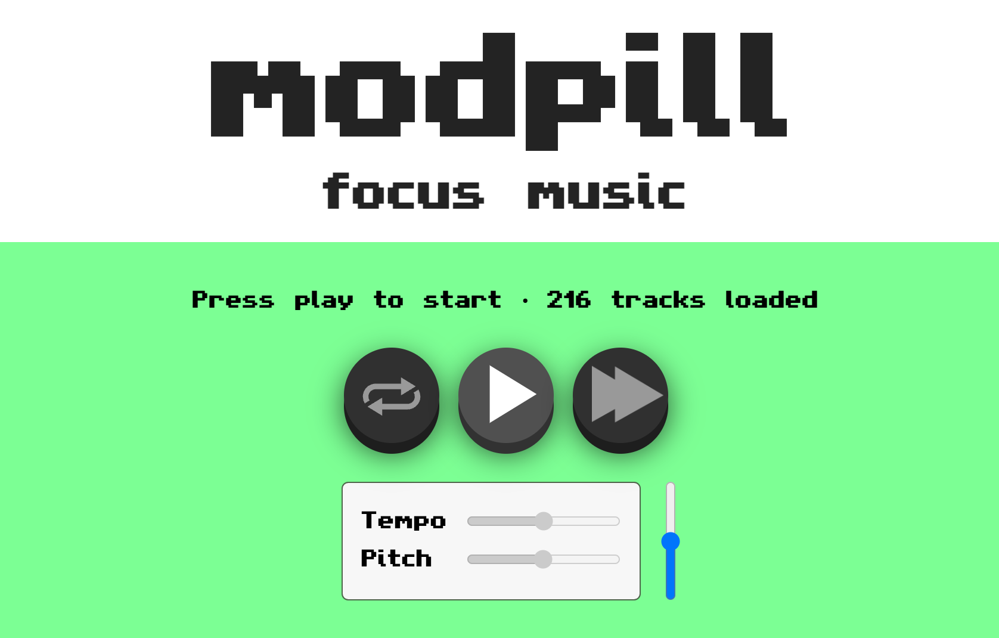

# Modpill – Focus music

200+ of the crunchiest, MOST reliable beats from the golden age of [Amiga MODs](https://en.wikipedia.org/wiki/MOD_(file_format)). Use recreationally or personalize the tuning to quickly achieve [flow state](https://en.wikipedia.org/wiki/Flow_(psychology)).

Best experienced with noise-cancelling and/or wireless headphones.

## The perfect soundtrack for any task

You've done enough studying and relaxing; now it's time to get things done. Tune the pitch and tempo to find your brain's secret internal rhythm and unlock a powerful new level of focus. But be careful – this amount of productivity can be addictive.

## An exceptional playlist

Thoughtfully curated over two decades, Modpill's playlist selects from the best tunes of the classic 90's [Demoscene](https://en.wikipedia.org/wiki/Demoscene) era and beyond. Cracktro, chiptune, fresh house, dark house, BGM and more, from timeless community favourites to deep cuts and undiscovered gems.

Notably, every track is ***Reliable***: that is, it'll play correctly at any pitch/tempo combination. Many great MOD files break down and become unlistenable when played at different pitches/tempos, but they've been carefully pruned from the collection.

### Tuning tips

Tuning is optional, but it only takes a minute to optimize Modpill for your work session:

- Find an upbeat track
- Adjust the tempo until you're **bobbing your head comfortably**. It shouldn't feel like it's rushing you or slowing you down.
- Adjust the pitch until you feel **tingles down your neck** and throughout your body. Find the sweet spot where the tingles persist as you bob your head.
- Increase the volume until it's **almost too loud** but still comfortable and safe. You may feel some euphoria here.
- If tuned correctly: you should now be completing your task! See you in x hours.

## Running the application

Download or clone the repo and place it in the `www` directory of your [Apache web server](https://httpd.apache.org/docs/2.4/platform/). Navigate to `http://localhost/modpill` to access the jukebox.

To use your own playlist or add/remove tracks, modify the `js/favlist.js` file, which uses file names and Mod Archive IDs.

## Credits & Licenses

Modpill pulls music files directly from Mod Archive as permitted for personal use under the [Mod Archive Distribution license](https://modarchive.org/index.php?terms-upload). [View the playlist on Mod Archive](https://modarchive.org/index.php?request=view_member_favourites&query=93325) to see more info on individual tracks.

Built with [Chiptune2.js](https://github.com/deskjet/chiptune2.js).

All code in this project is MIT (X11) licensed. The only exception are the compiled libopenmpt parts which remain under the OpenMPT project BSD license.
